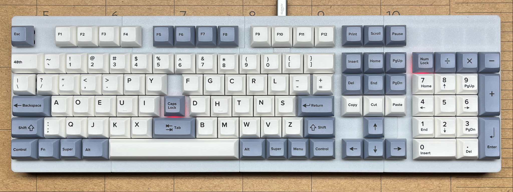

# writerz-with-an-attitude
Human-factored Post-Mechanical writing instruments for 'Writerz with an Attitude'.

Why are writers born in the third decade of the 21st century still being shackled to a 19th-Century mechanical typewriter interface?

Been using a Dvorak keyboard for thirty-five years. The Dvorak 2025 has the keys placed where my fingers expect them to be.

Built a Qwerty for my sister, she was happier using her old keyboard. Inhabitants of the Qwertyverse are a blissful lot. Never again.

I believe that single-hand writers should use a keyboard when crafting written language. That skill is best experienced as a tactle exercise.

1. New slim as possible PCB designs were developed to fit new sleek cases.
2. All of my keyboards use an RP2040 Elite-Pi controller, with KMK firmware.
3. All variants now have LED indicators (Caps Lock, Num Lock)
4. The Sixty percent keyboard has two 'Fn' LEDs for layer indication (working to create the code).  

My sister evaluated a TKL. As a result of her critique:

1. The USB port has been redesigned to make 'blind' plugging-in easier. 
2. The TKL is scrapped for a new full-sized variant, the 109-key Maximus.

Quality of key switches:

1. I built two full-sized keyboards with Gateron switches... never again! The switches are deformed; key caps are jacked at all angles. 
2. Cherry MX switches have great quality. Never had a problem with them. I now build all of my keyboards with Cherry switches.
3. The 3D printed case designs have been tweaked in OpenSCAD to insure that the sidewall mating surfaces meet perfectly.

After a month of struggle to get the Maximus case fit problems solved (the case would not sit flat on a desktop), I have learned that:

1. My Voron Trident cannot print exactly dimensioned case bottom sections. By fluke of design, those parts worked well enough for compact cases. 
2. This is no reflection on Voron Design, this problem is intrinsic to all CoreXY printers; well-built bed slingers do not have this fault.
3. My Prusa MK3.5 has a new companion... a Prusa MK4S. The new printer makes parts that match-up perfectly with the MK 3.5 parts.  
4. Print times for case bottom sections changed dramatically: from 3hs 15 mins to 1 hr 45 mins! I am now a Prusa snob.

Link to my repo of custom KiCad libraries: [MX Switch Custom](https://github.com/Dholydai/mx-switch-custom)

Ronald Earl Walker - Inventor of the Post-Mechanical Keyboard
   
