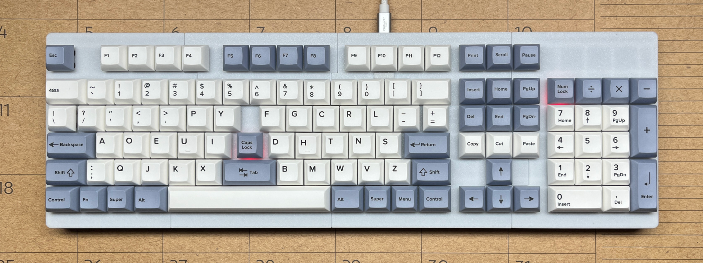
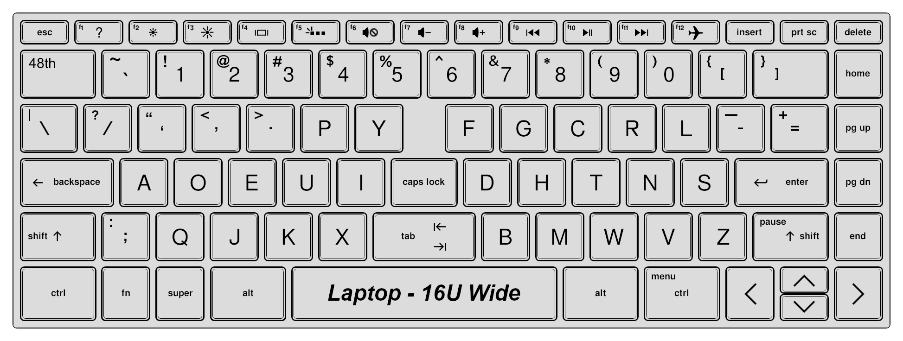
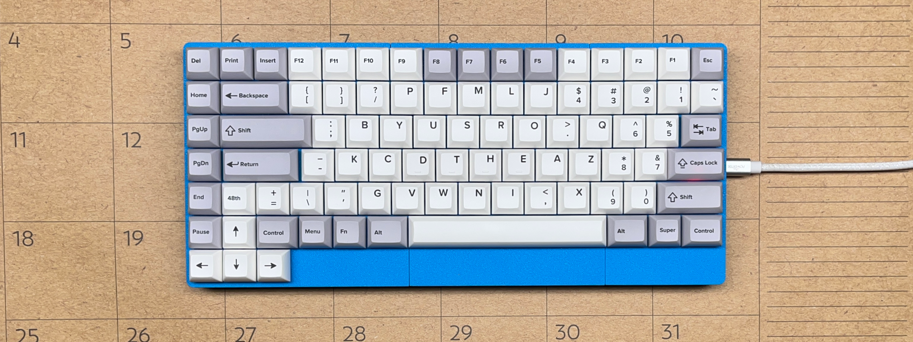

# writerz-with-an-attitude
Human-factored Post-Mechanical writing instruments for 'Writerz With an Attitude'.

Why are writers born in the third decade of the 21st century being shackled to a 19th-Century mechanical typewriter interface?

I have used a Dvorak keyboard for thirty-five years. After two decades of typing bad pains developed in my left hand and wrist. Analyzing 
my breakdown, I concluded that the physical arrangement of the keys on conventional keyboards forces operators into unnatural movements.

The hundred and fifty-two year old typewriter keyboard is injurious, as evidenced by the long line of 'typists' that developed carpal tunnel syndrome.

I designed the Dvorak 2025 to place the keys where the fingers of my two hands expect them to be. No more, writing is great fun now.

The Post-Mechanical variants establish a 'Nuevo Universal Keyboard' standard. These human-factored designs will fit in currently produced laptop
PC cases. The forty-eight character keys make the keyboards ISO compliant, compatable with European languages.

I have created ISO compliant firmware, and designed Windows drivers for five European languages. That work continues forward. 

Single-hand writers should have use of modern writing instruments. After World War 2 ended, LCDR Dvorak designed two thoughful single-hand letter 
schemes for the typewriter that enabled disabled veterans to write more comfortably.

My new compact single-hand keyboard designs have a few notable tweaks, but do not stray too far from the original designs. Both variants now share 
the same letter scheme. The left-hand and right-hand keyboards are mirror images of each other.

Quality of key switches:

Cherry MX switches have great quality. Never had a problem with them. I build all of my keyboards with Cherry switches.

Availability of keycap sets:

I have been subsituting common keycaps sizes for the exotic sizes required. I buy large XDA keycap sets, and relabel selected keycaps with keyboard 
stickers as needed.

Finding a 6U space is possible. My source makes spacebars with the stem 1\2U offset. I have designed alternate case top sections to accommodate that
spacebar. My PCBs have a dual position spacebar switch footprint to accommodate either keycap variant.

In May 2025 I found a diesub keycap manufacturer that makes one-off custom sets. The Maxmus shown above is populated by the first ugly set that I 
created. The grey turned out to have too much blue. I have used a truely neutral grey in the following nine keycaps set that I have purchased.

YUZU custom keycaps will make any die-sub keycap set that your heart desires. Common sizes still have to be sustituted. Being able to choose keycap 
sizes, colors, and legends is game changing. I have designed and bought five sets in two months. Good quality product.

3D printer problems:

The Maximus case would not sit flat on a desktop. After over a month of struggle to solve the problem, I have reluctantly concluded that:

1. My Voron Trident cannot print case top sections with enough quality. The X-axis to Y-axis geometry is not solidly 90 degrees.
2. This problem is intrinsic to all Core-XY printers; well-built bed slingers do not have this fault.
3. My Prusa MK3.5 has a new companion... a Prusa MK4S. The new printer makes parts that match-up perfectly with the MK 3.5 parts.  
4. Print times for a case bottom section changed dramatically: from 3hs 15 mins to 1 hr 45 mins. I am now a committed Prusa fanatic.

Link to my repo of custom KiCad libraries: [MX Switch Custom](https://github.com/Dholydai/mx-switch-custom)

Ronald Earl Walker - Inventor of the Post-Mechanical Keyboard
   
