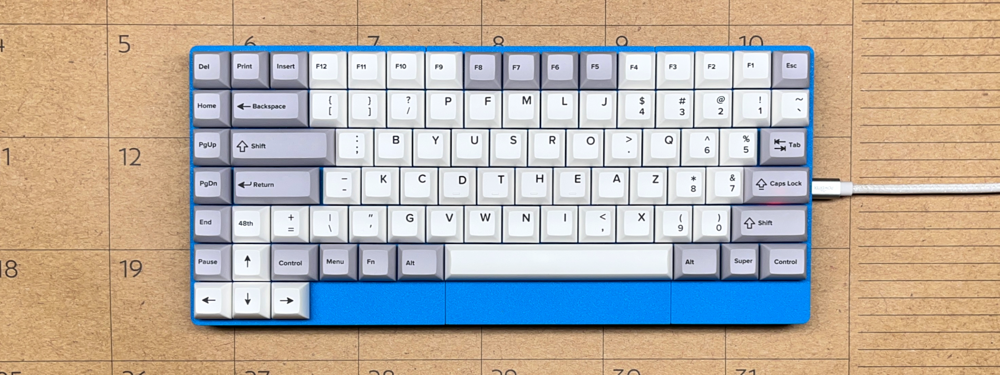

# writerz-with-an-attitude
Human-factored Post-Mechanical writing instruments for 'Writerz With an Attitude'.

Why are writers born in the third decade of the 21st century still being shackled to an injurious 19th-Century mechanical typewriter interface?

I have been a Dvorak keyboard user for thirty-five years. After two decades of typing bad pains developed in my left hand and wrist. Analyzing 
my breakdown, I concluded that the physical arrangement of the keys on conventional keyboards is unnatural.

I designed the Dvorak 2025 to place the keys where the fingers of my two hands expect them to be. I no longer have pain, writing is great fun.

The Post-Mechanical variants establish a new universal keyboard standard. These human-factored designs will fit in currently produced laptop
PC cases. The forty-eight character keys make the keyboards ISO compliant, compatable with European languages.

Single-hand writers should have use of modern writing instruments. After World War 2, LCDR Dvorak designed two thoughful single-hand letter 
schemes for the typewriter so disabled veterans could write more comfortably.

My new compact single-hand keyboard designs have a few notable tweaks, but do not stray too far from the original designs. Both variants now share 
the same letter scheme. The left-hand and right-hand keyboards are mirror images of each other.

Quality of key switches:

1. I built two full-sized keyboards with Gateron switches... never again! They are deformed; key caps are jacked around at all angles. 
2. Cherry MX switches have great quality. Never had a problem with them. Going forward, I build all of my keyboards with Cherry switches.

Availability of keycap sets:

I have been subsituting common keycaps sizes from large XDA keycap sets, and relabeling them with keycap stickers as needed.

YUZU custom keycaps will make any die-sub keycap set that your heart desires. Common sizes still have to be sustituted. Being able to choose 
keycap sizes, colors, and legends is 'just what the doctor ordered'. I have designed and bought five sets in two months. Even
with the new high tariffs, the price is a affordable. Good quality product.

3D printer problems:

The Maximus case would not sit flat on a desktop. After over a month of struggle to get past the problem, I have learned that:

1. My Voron Trident cannot print quality parts. By fluke of design, the parts were adequate enough for two-section compact case bottoms. 
2. This is no reflection on Voron Design, this problem is intrinsic to all CoreXY printers; well-built bed slingers do not have this fault.
3. My Prusa MK3.5 has a new companion... a Prusa MK4S. The new printer makes parts that match-up perfectly with the MK 3.5 parts.  
4. Print times for case bottom sections changed dramatically: from 3hs 15 mins to 1 hr 45 mins. I am now a committed Prusa fanatic.

Link to my repo of custom KiCad libraries: [MX Switch Custom](https://github.com/Dholydai/mx-switch-custom)

Ronald Earl Walker - Inventor of the Post-Mechanical Keyboard
   
